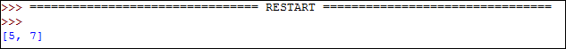
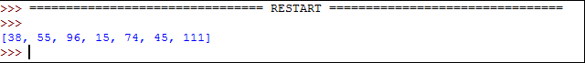

# Introduksjon {.intro}

I denne oppgaven skal vi lære litt om hvordan vi kan bruke lister i Python.


# Steg 1: Opprette og legge til ting i en liste {.activity}
## Sjekkliste {.check}
+ Vi begynner helt enkelt. Disse fire linjene i python lager først en tom liste som vi så putter inn verdiene 5 og 7. "liste" vil nå huske at den inneholder 5 og 7 til vi endrer hva den skal huske. Du kan kalle listen hva du vil.


**Tips:** Du trenger ikke skrive det som står bak # - tegnet i koden under:
```python3	
liste = []			# Denne linjen oppretter en tom liste som heter 'liste'
liste.append(5)		# .append() legger til en verdi bakerst i listen
liste.append(7)

print(liste)
```
Dette er resultatet av å trykke på Run Module på koden over, får du det samme?:



Vi kan også legge inn verdier i listen helt fra starten av:
```python3
liste = [5, 7]
```

+ Lister i python er null-indeksert. Dette betyr at hver posisjon i listen har et tall som adresse og at adressene (eller posisjonene) starter på 0 og øker med en og en. I vårt tilfelle har 5 posisjon 0, mens 7 har posisjon 1.

Vi bruker `[]` rett etter listen sitt navn for å finne ut hvilket tall som er på en bestemt posisjon.

```python3	
liste = []	        # Denne linjen oppretter en liste som heter 'liste'
liste.append(5)		# .append() legger til en verdi i listen
liste.append(7)

print(liste)

tall1 = liste[0]        # Vi finner her ut hvilket tall som er på posisjon 0
tall2 = liste[1]

print("Det første tallet i listen er " + str(tall1) + " og det andre tallet i listen er " + str(tall2))
```
**Tips:** `str(5)` gjør tallet 5 om til en streng som er tallet 5, denne kan nå printes i kombinasjon med andre strenger.

+ Du har nå lært å lage en liste i Python, prøv selv å lage flere lister med forskjellige navn og legg inn dine egne verdier.

+ Man kan også legge inn ord og bokstaver i en liste. En sekvens med tegn, slik som et ord, kalles en streng. Lag lister som inneholder strenger (String på engelsk).


# Steg 2: Finne største og minste tall i en liste {.activity}

Nå skal vi lære en måte hvordan man kan finne ut hvilket tall som er størst og minst i en liste.

## Sjekkliste {.check}

+ Start med å lage en liste som inneholder flere enn 5 tall.

Eksempel:



+ En løkke er en måte man kan gjøre det samme om igjen flere ganger. For å finne det minste tallet i en liste har vi lyst til å sammenligne alle tallene vi har i listen med et annet tall. 
Start med å lage en løkke som skriver ut alle tallene i listen en etter en. 
**Tips:** `len(liste1)` finner ut hvor mange tall som er i listen som heter liste1. 


#### Løsing:

```python3
mange_tall = [38, 55, 96] # Legger til noen verdier helt fra starten

mange_tall.append(15)		# Legger til flere verdier
mange_tall.append(74)
mange_tall.append(45)
mange_tall.append(111)

antall_tall = len(mange_tall) 		# 'antall_tall' husker fra nå av hvor mange tall som er i listen vår

for posisjon in range(antall_tall):
    tall = mange_tall[posisjon]		# 'tall' er tallet som ligger på posisjonen i listen med adressen lik posisjon. 
    print(tall)						# Printer tallet
```


#### If-Setninger:

+ Nå kommer vi til å få bruk for det som heter "if-setninger". "If" betyr som du vet "hvis" på engelsk. En "if-setninger" sjekker om en påstand er sann eller ikke. Hvis påstanden er  sann gjør koden en ting hvis den ikke er sann gjør den noe annet.

```python3
tall = 12

if (tall > 10):
	print("Tallet er større enn 10 !")
```

+ Får å finne det minste tallet i listen starter vi med en antakelse om at det første tallet i listen er minst. Deretter sjekker vi i If-setningen om det minste tallet vi har funnet til nå er større enn den neste tallet vi kommer til. Hvis det neste tallet er større skal det bli det nye minste tallet vi har funnet. For-løkken sørger for at vi sjekker alle tallene i listen.

```python
mange_tall = [38, 55, 96] # Legger til noen verdier helt fra starten

mange_tall.append(15)		# Legger til flere verdier
mange_tall.append(74)
mange_tall.append(45)
mange_tall.append(111)

minste = mange_tall[0] 		# Her gjør vi antagelsen om at det første er det minste

for posisjon in range(len(mange_tall)):
    if(minste > mange_tall[posisjon]):
        minste = mange_tall[posisjon]

print("Det minste tallet i listen er "+ str(minste))
```

+ Lag et nytt program som finner det største tallet i listen.

## Utfordring: Regn ut gjennomsnitt {.challenge}
Lag et program som regner ut gjennomsnittsverdien til alle verdiene i en liste.

## Utfordring: Kjempestor liste {.challenge}
Prøv å lag en kjempe stor liste og finn det minste og største tallet i den. 